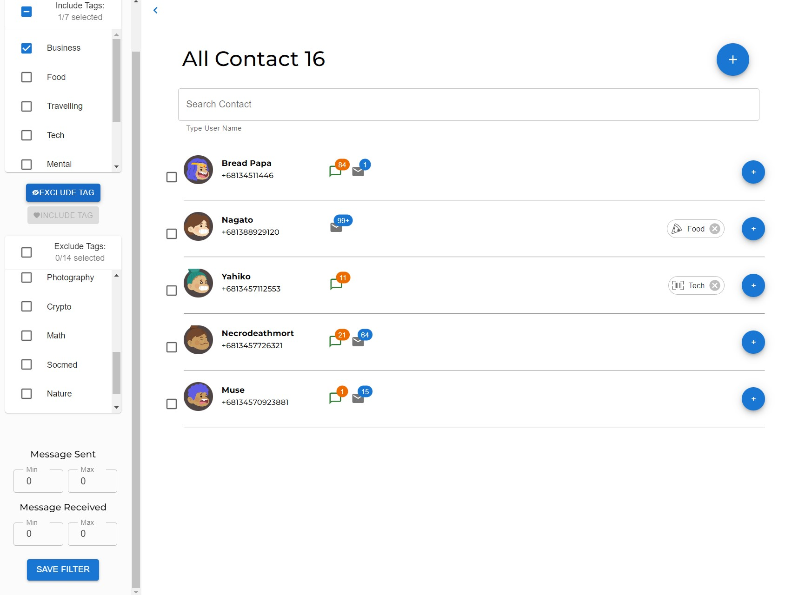

### Features

- Login, Logout (Create "token" in local storage);
- You can enter any string/numeric/any characters in "Phone Number" form ;
- "Password" can be anything as well, there is no authentication mechanism;
- "Phone Number" || "Password" can not be null;
- filtering users according search form payload(tags, min/max sent, min/max received);

# Chat Homey - a ChatDaddy testing

<h1>Tech Explanation</h1>
Vite based React App, using MUI, Lottie, SCSS, Docker.

<h3>How to run</h3>

    Git clone
    npm i / npm i --force (in case brute force is needed)
    docker build -t <container name> .
    docker run -p 8080:8080 <container name>
    go to http://localhost:8080/

<h3>Or simply run</h3>

    Git clone
    npm i / npm i --force (in case brute force is needed)
    npm run dev

<h3>Screenshots</h3>

    1. Login Screen (if user dont have any token in browser's local storage will redirect to "/login")

    2. After user login automatically navigate to "/", and supposedly cannot go to "/login"
    look at small magnifier at left top if you click it will expand search form

    3. Then you can hit "Save Filter" on the bottom sidebar to begin filtering user

    4. Try to add or remove tags in Include Tags by checking the checkbox in prefix Tags then hit middle button

    5. Search name is working
